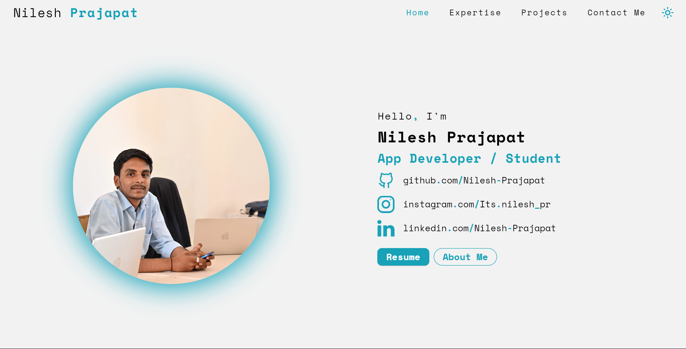
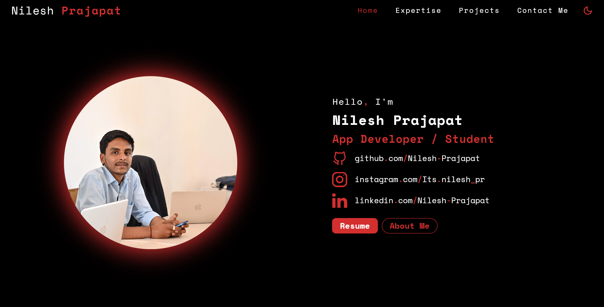

<!DOCTYPE html>
<html lang="en">
<head>
  <meta charset="UTF-8">
  <meta name="viewport" content="width=device-width, initial-scale=1.0">
</head>
<body>

  <h1>📌 Portfolio</h1>
  
<b>Welcome to my portfolio!</b> I am a passionate <u>Computer Science & Engineering (CSE) student</u> specializing in <b>Flutter app development</b>.

  
This project is a <b>fully responsive</b> cross-platform application built with <b>Flutter</b> and hosted on <b>Vercel</b>. It runs smoothly on <i>Web, Android, and iOS</i> without requiring a backend.

  

  

    <h1>🚀 Live Project</h1>
    
Experience the project in action! Click the link below to explore its features, design, and responsiveness in real time.

    
<b>Test it on multiple devices</b> and see how it adapts across platforms!

    
<a href="https://your-project.vercel.app/" target="_blank"><b>⡠Click here to view the project ⬅</b></a>

  

  

  <h2>📸 Project Screenshots</h2>
  
Take a look at how the home page looks in both light and dark themes:

  

    <table border="1" width="80%" cellspacing="0" cellpadding="10">
      <tr>
        <th>Light Theme</th>
        <th>Dark Theme</th>
      </tr>
      <tr>
        <td align="center">
          
        </td>
        <td align="center">
          
        </td>
      </tr>
    </table>
  

  

  <h2>🛠️ Features</h2>
  <ul>
    <li><b>🌍 Cross-Platform:</b> Works on Web, Android, and iOS.</li>
    <li><b>⚡ Fast & Lightweight:</b> Optimized for smooth performance.</li>
    <li><b>🎨 Modern UI:</b> Clean, simple, and interactive interface.</li>
    <li><b>📁 Showcases My Work:</b> Displays projects and skills.</li>
    <li><b>🔄 Regular Updates:</b> New features and improvements added frequently.</li>
  </ul>

  

  <h2>🧑‍💻 Tech Stack</h2>
  <ul>
    <li><b>🚀 Framework:</b> Flutter</li>
    <li><b>🌐 Hosting:</b> Vercel</li>
    <li><b>💡 Languages:</b> Dart, HTML</li>
    <li><b>📱 Platforms:</b> Web, Android, iOS</li>
  </ul>

  

  <h2>📅 Future Enhancements</h2>
  
Here are some planned updates:

  <ol>
    <li>🔧 <b>Enhancing performance optimization.</b></li>
    <li>🎭 <b>Improving theme customization.</b></li>
    <li>📱 <b>Adding more interactive animations.</b></li>
    <li>🌎 <b>Multilingual support for a global audience.</b></li>
  </ol>

  

  <h2>🔗 Connect With Me</h2>
  <ul>
    <li>📷 <b>Personal Instagram:</b> <a href="https://www.instagram.com/nilesh__pr_/" target="_blank">@nilesh__pr_</a></li>
    <li>💼 <b>Work Instagram:</b> <a href="https://www.instagram.com/its.nilesh_pr/" target="_blank">@its.nilesh_pr</a></li>
    <li>👨‍💻 <b>LinkedIn:</b> <a href="https://www.linkedin.com/in/nilesh-prajapat" target="_blank">@nilesh-prajapat</a></li>
    <li>🐙 <b>GitHub:</b> <a href="https://github.com/nilesh-prajapat" target="_blank">@nilesh-prajapat</a></li>
  </ul>

  

  <h2>🎯 Why This Project?</h2>
  
I created this portfolio to showcase my skills and projects in a <b>simple yet effective</b> manner.

  

  <h2>💡 Learning & Experience</h2>
  
This project helped me explore:

  <ul>
    <li>🚀 <b>Best practices in Flutter development.</b></li>
    <li>🌐 <b>Deployment on Vercel.</b></li>
    <li>📱 <b>Creating a fully responsive app.</b></li>
    <li>⚡ <b>Performance optimization techniques.</b></li>
    <li>💻 <b>Improving UI/UX for better user experience.</b></li>
  </ul>

  

  

    
🚀 Made with ❤️ by <b>Nilesh Prajapat</b>

    
📧 Email: <a href="mailto:work.nilesh.pr@gmail.com">Work.nilesh.pr@gmail.com</a>

  

  

  <footer>
    

      
© 2025 Nilesh Prajapat | All Rights Reserved.

    

  </footer>

</body>
</html>
